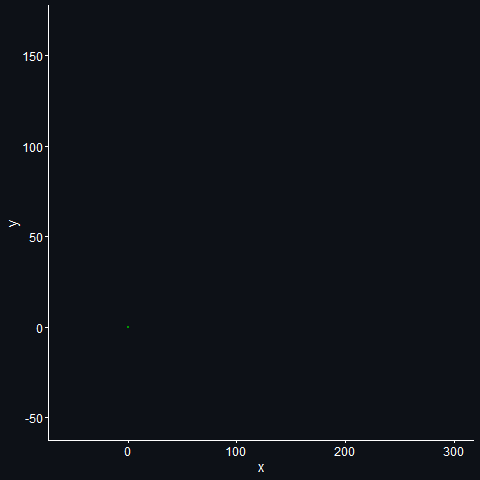
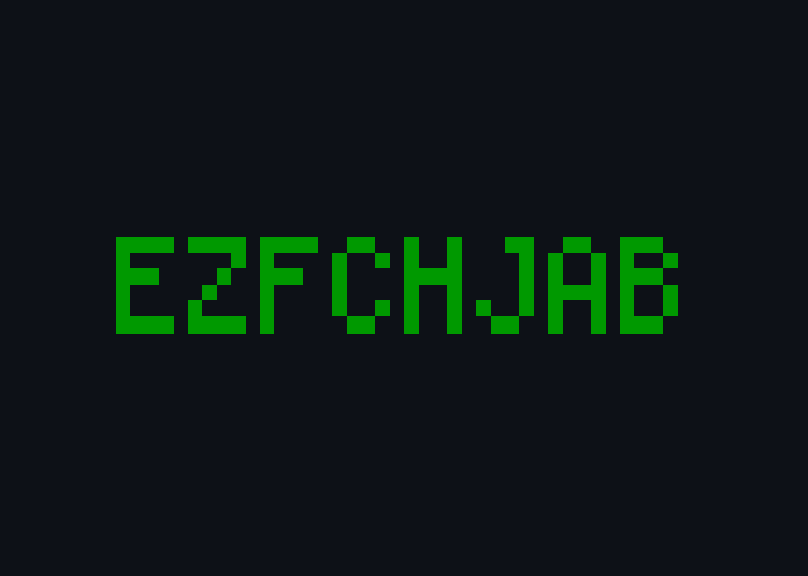

README
================

# Advent of Code 2022

This repo contains my solutions for the [Advent of
Code](https://adventofcode.com/) 2022 in `R`. This is my 3rd AoC; in
2020, I got 31 stars; in 2021, I got 33 stars. Let’s see whether I can
manage at least 35 this year :-)

Follow me on [Mastodon](https://fosstodon.org/@juli_nagel), where I will
post about my solutions as well!

## TOC

The scripts for my solutions are named after the respective day
(e.g. `day01.R`). The corresponding inputs (`day01.txt`) can be found in
the folder `inputs`. Here is a table of contents showing you what each
day was about, along with some stats. Completion time refers to the time
it took me to complete the puzzle since release (part 1, and part 2 in
brackets), as tracked on the Advent of Code website[^1]. Next is my rank
for the puzzle on that day (part 1 (part 2)), and finally the runtime of
my code. It’s a crude measure of runtime[^2], where I simply calculate
the difference in `Sys.time()` at the beginning and the end of part 1,
and the beginning and end of part 2 . That means in some occasions, the
runtime for part 2 will be much shorter because part of the code needed
to solve part 2 was already run in part 1 . Reading and preprocessing
the data is always part of part 1 (and, if a re-set necessary, also of
part 2) .

Day 7 almost broke me. I wrote some ugly ass code and barely managed to
make it work before I had to start my *actual* work. I ain’t pretty, but
it gets the gold stars in.

| Day | Title                   | Completion Time     | Rank          | Runtime               |
|-----|-------------------------|---------------------|---------------|-----------------------|
| 1   | Calorie Counting        | 00:05:11 (00:07:02) | 2767 (2329)   | 9.34 (0.88) ms        |
| 2   | Rock Paper Scissors     | 00:17:34 (00:24:30) | 7120 (6282)   | 13.54 (12.02) ms      |
| 3   | Rucksack Reorganization | 00:17:28 (00:29:45) | 6247 (6570)   | 13.67 (9.34) ms       |
| 4   | Camp Cleanup            | 00:06:35 (00:07:24) | 2348 (1292)   | 19.91 (13.86) ms      |
| 5   | Supply Stacks           | 00:37:57 (00:39:47) | 7393 (6328)   | 151.17 (24.45) ms     |
| 6   | Tuning Trouble          | 00:14:33 (00:23:03) | 8999 (10772)  | 112.93 (152.02) ms    |
| 7   | No Space Left On Device | 02:26:18 (03:38:11) | 13307 (16347) | 105.27 (4.02) ms      |
| 8   | Treetop Tree House      | 00:39:33 (01:29:45) | 7446 (9576)   | 566.91 (729.69) ms    |
| 9   | Rope Bridge             | 02:45:47 (15:44:12) | 15774 (37468) | 1.52 s (1.76 min[^3]) |
| 10  | Cathode-Ray Tube        | 04:29:34 (05:07:57) | 21235 (19194) | 16.83 (24.69) ms      |
| 11  | Monkey in the Middle    | 09:59:28 (10:12:38) | 30462 (22506) | 56.51 ms (1.67 s)     |
| 12  | Hill Climbing Algorithm | 03:20:46 (03:34:46) | 10025 (9739)  | 3.43 (7.53) min[^4]   |

## Data Viz

Here are some plots for the puzzles.

### Day 1

A histogram of the calories per elf.

### Day 4

Here are the sections each elf(-pair) is covering in green. Overlaps
between the two elves are plotted in gold. The plot is arranged by
overlap size, i.e. the two elves with the most overlapping sections are
on top.

### Day 8

A map of the forest of day 8. The brighter the colour, the higher the
tree.

### Day 9

Here is an animation[^5] of all the locations all knots visited. The
current position of the knots in each iteration are plotted in green,
and the locations the tail already visited are highlighted in gold. I am
not happy with the speed of the gif, but any attempt on making it faster
resulted in too many green points plotted at the same time (it was
already a fight to have the gold line stay, but have the correct number
of green points popping up at the same time) - or in the gold line going
crazy. If anyone knows how to improve the situation, feel free to slide
into my dms!

### Day 10

Here is the message that is displayed on my “screen” at the end of day
10.

[^1]: Until day 8, I managed to get up when each puzzle is released (6
    am in my time zone, so manageable) and to complete them before I had
    to leave for work. That wasn’t possible anymore afterwards.

[^2]: I know these stats are basically meaningless for anyone else’s
    computer, but to put things into perspective, here are my computer
    stats: Razer Blade 15 Base Model, Intel Core i7-10750H CPU @
    2.60GHz, 259 Mhz, 6 Cores, 12 Logical Processors, 16 GB RAM

[^3]: For part 2, I’m saving every single position of every single knot
    for a fancy animation later.

[^4]: How long does it take to render that beast, you wonder? It takes
    “cleaning a small bathroom thoroughly” minutes.

[^5]: How long does it take to render that beast, you wonder? It takes
    “cleaning a small bathroom thoroughly” minutes.
